# Apa itu Pritunl ?
Pritunl adalah server VPN perusahaan sumber terbuka yang mendukung protokol OpenVPN, IPsec, dan WireGuard. Hal ini memungkinkan pengguna untuk membuat jaringan pribadi virtual yang aman, menghubungkan jaringan cloud, dan menyediakan akses jarak jauh dengan fitur keamanan tingkat lanjut. Aspek unik termasuk peering VPC multi-cloud, otentikasi perangkat TPM dan Apple Secure Enclave, dan sistem plugin Python yang dapat disesuaikan.

Berikut adalah step by step untuk setup a self-hosted Pritunl VPN di AWS EC2 instance.

Task yang akan di implementasikan:
1. How to install and configure Pritunl
2. How to create and set up VPN users (clients)
3. How to connect and authenticate users using a VPN client app
4. How to configure split tunneling to route only AWS traffic through the VPN

## Setting Pritunl VPN on EC2 Instance
Pritunl menggunakan `MongoDB` untuk mengakses user data dan `VPN Configuration`. Di setup ini, kita akan menginstall `MongoDB` di `EC2 Instance` yang sama, untuk `production HA (High Availability)` setup. Sebaikan `database` di tempatkan pada instance yang terpisah dan khusus. 

## How it work ?
- Berikut cara kerjanya.
Pengguna pertama-tama membuat **tunnel VPN** ke server **Pritunl** yang berada di **public subnet AWS** menggunakan **Pritunl VPN client**.

Setelah proses autentikasi berhasil, sebuah **tunnel yang aman dan terenkripsi** akan dibuat melalui internet dari **workstation lokal** menuju **server VPN Pritunl**.

Ketika pengguna mencoba mengakses **resource private AWS** yang berada pada jaringan yang telah dikonfigurasi di Pritunl, koneksi dari workstation lokal akan mencapai server VPN melalui **tunnel terenkripsi** tersebut. Setelah itu, trafik akan **didekripsi** oleh server VPN sehingga dapat mengakses **resource private di AWS**.

## Pritunl VPN Workflow 
Berikut diagram yang memperlihatkan flow traffic mengakses AWS Private Resources menggunakan Pritunl VPN server.
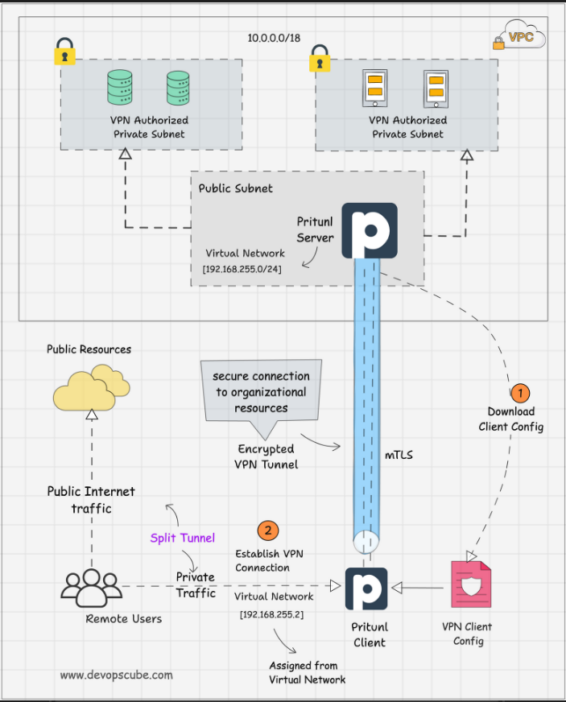

## Implementation

Di implementasi awal kita memerlukan untuk setup:
1. AWS EC2 Instance, saya menggunakan spesifikasi instances berikut
	-  instance type: t2.large 
	-  storage: 15 GB
	-  VPC: default
	-  Security Group: default vpc
2. Security Group, Inbound rule: 
	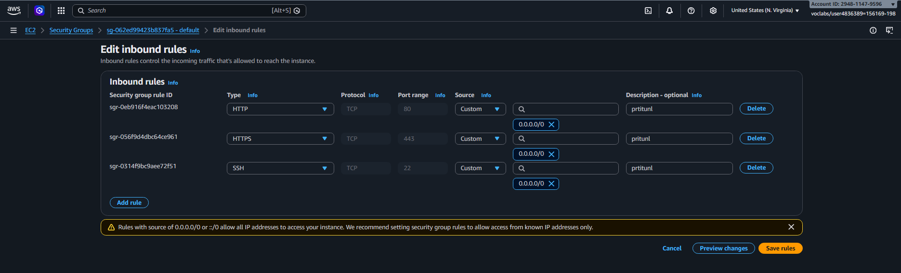

Lakukan remote pada instance, untuk implementasi konfigurasi `pritunl vpn`. bisa menggunakan `connect with browser` atau `melakukan ssh dari cmd menggunakan key pair` 

### Menambahkan Pritunl, OpenVPN, dan MongoDB Repositories

Menambahkan repository untuk menginstall Pritunl, OpenVPN, dan MongoDB

1. menambahkan repo `mongodb`
```bash
sudo tee /etc/apt/sources.list.d/mongodb-org.list << EOF
deb [ signed-by=/usr/share/keyrings/mongodb-server-8.0.gpg ] https://repo.mongodb.org/apt/ubuntu noble/mongodb-org/8.0 multiverse
EOF
```

2. menambahkan repo `openvpn`
```bash
sudo tee /etc/apt/sources.list.d/openvpn.list << EOF
deb [ signed-by=/usr/share/keyrings/openvpn-repo.gpg ] https://build.openvpn.net/debian/openvpn/stable noble main
EOF
```

3. menambahkan repo `pritunl vpn`
```bash
sudo tee /etc/apt/sources.list.d/pritunl.list << EOF
deb [ signed-by=/usr/share/keyrings/pritunl.gpg ] https://repo.pritunl.com/stable/apt noble main
EOF
```

### Menambahkan GPG Keys

Install GPG tools untuk menghandle verifikasi keys dari packages resource
```bash
sudo apt --assume-yes install gnupg
```

Menambahkan  GPG Keys untuk packages

Download GPG Keys `MongoDB` packages
```bash
curl -fsSL https://www.mongodb.org/static/pgp/server-8.0.asc | sudo gpg -o /usr/share/keyrings/mongodb-server-8.0.gpg --dearmor --yes
```

Download GPG Keys `OpenVPN` packages
```bash
curl -fsSL https://raw.githubusercontent.com/pritunl/pgp/master/pritunl_repo_pub.asc | sudo gpg -o /usr/share/keyrings/pritunl.gpg --dearmor --yes
```

Download GPG Keys `Pritunl` packages
```bash
curl -fsSL https://raw.githubusercontent.com/pritunl/pgp/master/pritunl_repo_pub.asc | sudo gpg -o /usr/share/keyrings/pritunl.gpg --dearmor --yes
```

### Install Pritunl, OpenVPN, MongoDB, dan Wireguard

`Pritunl` bukan sebuah `VPN` secara langsung, sebaliknya `Pritunl` berfungsi sebagai layer management untuk server `vpn` seperti `OpenVPN` dan `WireGuard`. `Pritunl` menghandle bagian user management, connection routing, dan menyediakan antarmuka web.


Pertama lakukan update packages dan install packages yang dibutuhkan:
```bash
sudo apt update
sudo apt --assume-yes install pritunl openvpn mongodb-org wireguard wireguard-tools
```

Disable firewall untuk menghindari masalah connection
```bash
sudo ufw disable
```

Start dan enable Pritunl dan MongoDB Services
```bash
sudo systemctl start pritunl mongod
sudo systemctl enable pritunl mongod
```


`Pritunl` mendukung protokol `OpenVPN` dan `WireGuard`, perlu menginstall setidaknya salah satu dari keduanya. Secara default, `pritunl` menggunakan `OpenVPN`. `Pritunl` akan membuat file konfigurasi sementara di direktori `/tmp`. Kita dapat melihat detail koneksi dengan menggunakan argumen `--management` yang terdapat di file konfigurasi sementara tersebut.


### Setup Pritunl Web Interface
Sebelum mengakses `Pritunl Web Interface`, Pastikan inbound rule di security group untuk rule SSH, HTTP, dan HTTPS sudah ditambahkan.


Jika sudah menambahkan rule yang sudah ditentukan agar kita bisa mengakses web interfacenya, masukan ip public instance ke browser. lalu lakukan setup `database mongoDB`. 

> `MongoDB` secara otomatis terintegrasi dengan `Pritunl Server`, `MongoDB service` mengekspose port nya pada 27017, `Pritunl` memiliki konfigurasi bawaan di `/etc/pritunl.conf` dengan alamat ip localhost:27017. Namun jika menggunakan `MongoDB` Server terpisah, perlu untuk mengubah `mongodb_url` pada file  `/etc/pritunl.conf`  dengan detail server external.


Untuk mendapatkan `Pritunl` server setup key, gunakan command berikut 
```bash
sudo pritunl setup-key
```

key setup berbeda setiap server, jadi salin dan masukan ke dalam dashboard berikut.
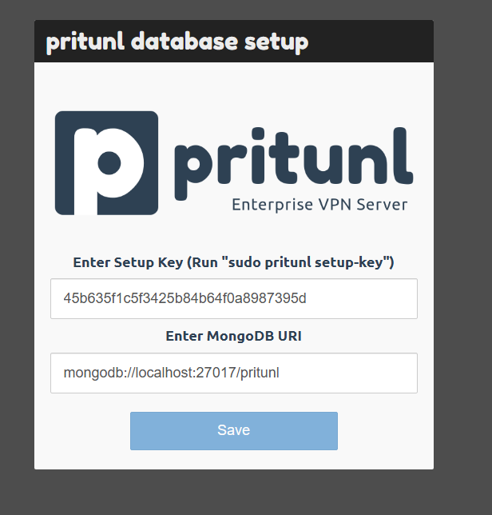


Login menggunakan default credentials, Gunakan command berikut 
```bash
sudo pritunl default-password
```

Masukan credentials ke dashboard berikut.
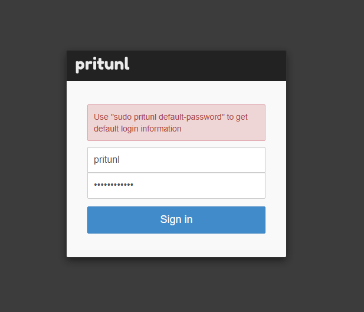


Untuk `Initial Setup` perlu membuat username dan password supaya tidak perlu lagi menggunakan credentials default.


Cukup setting username dan password, lalu save perubahannya.
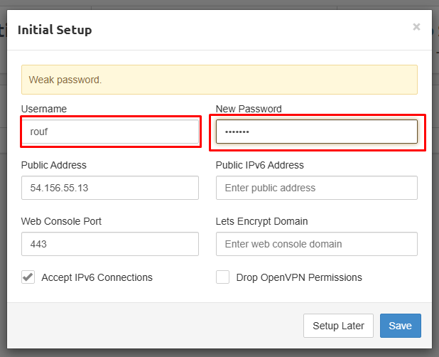


### Configure Pritunl VPN Server

Konfigurasi dimulai dari membuat `organization`, yang akan mengatur semua konfigurasi. Kita dapat membuat beberapa `organization` jika di perlukan.


Navigasi ke `users` tab dan klik button `Add Organization` untuk membuat `Organization` baru.
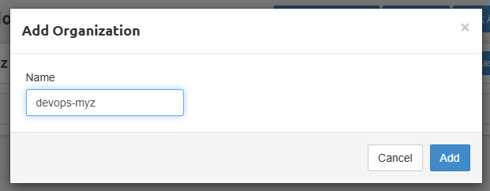


Navigate ke `server` tab dan klik button `Add Server` untuk membuat server baru.
> di versi gratis `pritunl`, kita hanya bisa membuat 1 server.

> `Virtual Network` adalah rentang jaringan yang ditetapkan klien VPN. Artinya, setiap user yang menggunakan klien `Pritunl` untuk terhubung ke server ini akan mendapatkan `IP` yang di tetapkan `CIDR Virtual Network` yang di konfigurasi. Rentang jaringan ini tidak boleh sama dengan yang digunakan user atau jaringan yang di gunakan di `AWS VPC` yang menjadi bagian dari `VPN`. Jika sama, konflik IP bisa terjadi.

Di bagian tab konfigurasi server,  kita perlu melakukan konfigurasi DNS server details, port, protocol, virtual network, dan authentication options.
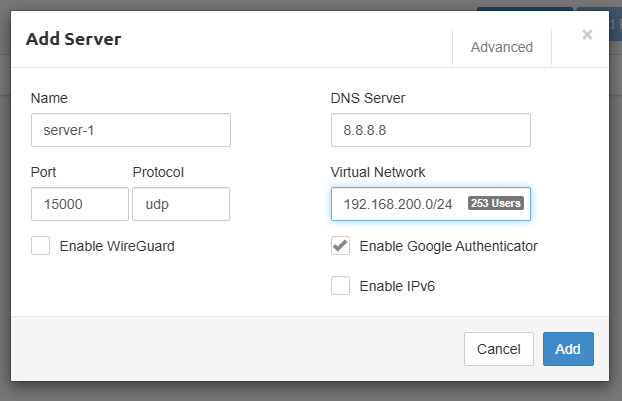


Jika konfigurasi sudah dilakukan, perlu untuk melakukan `bind` pada organization untuk menggunakan server.
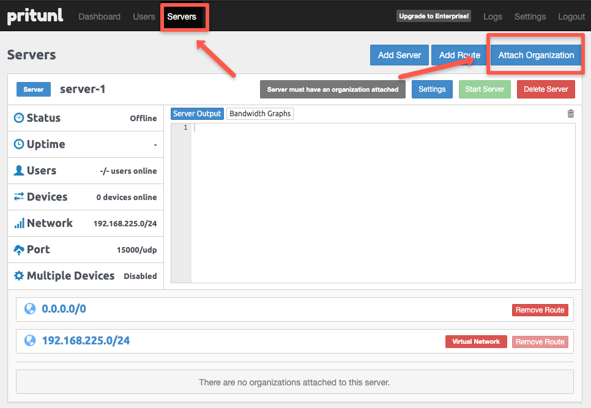


Select `organization name` dan `server name`, untuk melakukan attach dari `organization` ke `server`.
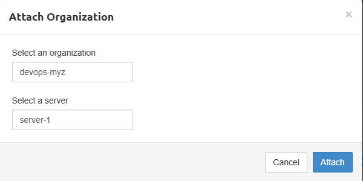


Kita perlu memberikan informasi tentang private subnet AWS yang ingin kita hubungkan dengan aman. Kita dapat menambahkan seluruh VPC atau hanya menentukan subnet tertentu yang ingin di akses dari workstation lokal. Ini menentukan jaringan mana yang harus di sediakan akses aman dan terenkripsi oleh server VPN. 

Navigasi ke button `Add Route` pada tab `Server`.
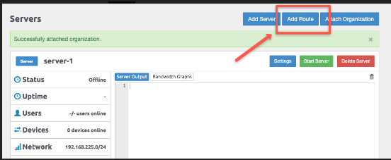


Untuk testing, disini saya menambahkan `VPC CIDR`.
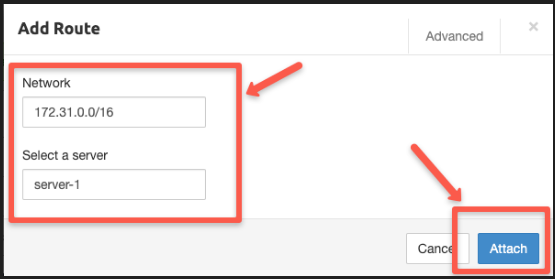


### Create Pritunl Users on Server
Server sudah jalan dan running, Sekarang perlu untuk membuat user (client) dan konfigurasi user untuk `VPN server access`.


Navigate ke tab users dan klik button `Add User` untuk menambahkan user baru, User ini digunakan untuk login ke `Pritunl Server` kita sebagai client yang terhubung.

> Note: Informasi Email dan Pin sebenarnya opsional untuk di isi. 
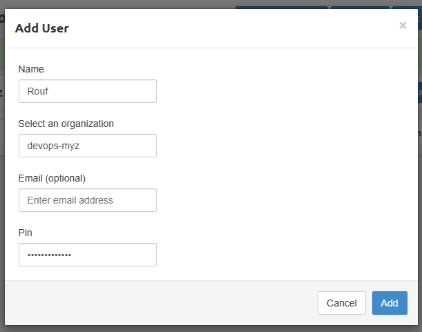

Kita bisa membuat banyak user jika kita mau, `Pritunl` tidak memiliki limit pada pembuatan user. Setelah membuat user, kita perlu membuat koneksi antara local dengan `VPN server`.


Klik Download profile, untuk digunakan login di `Pritunl Client` nantinya. Download `Pritunl Client` di link berikut [link-download-pritunl](https://client.pritunl.com/#install)
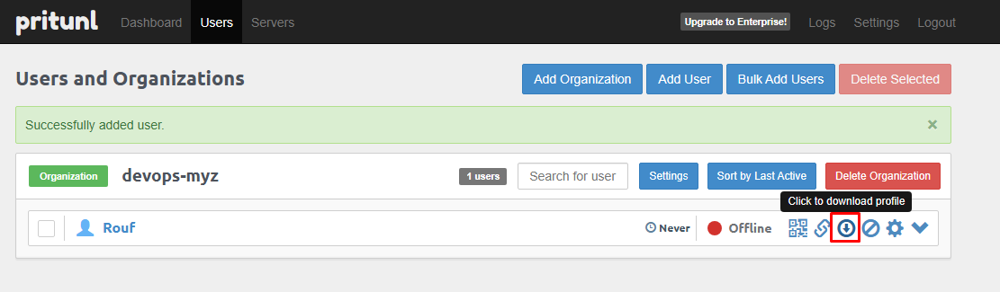

Tambahkan `ip public` dari local ke `security group`, agar `Pritunl Client` dapat mengakses `Pritunl Server`
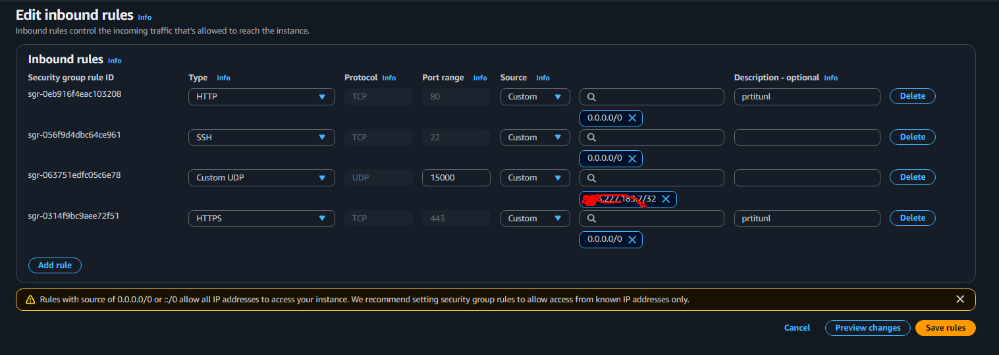


Klik import, lalu klik browse pilih Profile User yang di download dari `Pritunl Server`
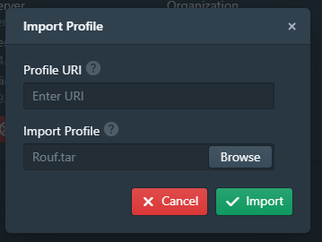

Klik button connect, lalu masukan pin jika tadi di `Pritunl Server` mengisi pin information.
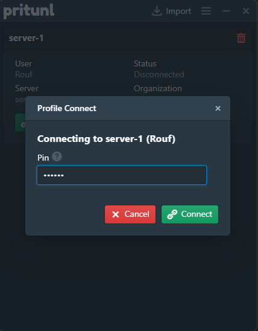


Koneksi client dan server berhasil terhubung.
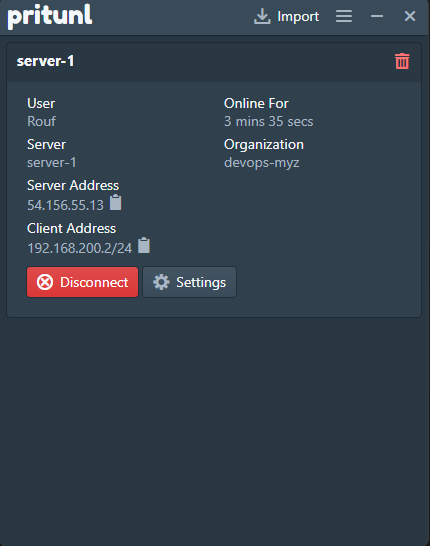


Namun, ini adalah koneksi `VPN full-tunnel`. Yang berarti tidak hanya AWS tetapi semua traffic internet di arahkan/rute kan melalui `VPN` dan di `Enkripsi`.
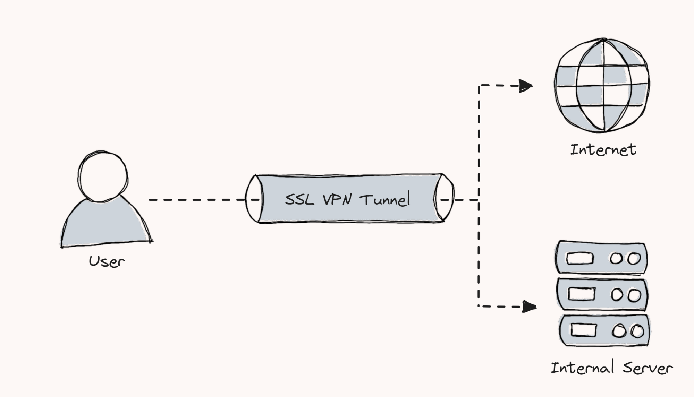

Dampak dari menggunakan full-tunnel adalah koneksi internet menjadi lumayan lambat. Karena semua traffic internet di arahkan ke `VPN Server`. 
```bash
Computer → semua traffic → VPN Server AWS → Internet
                              ↓
                       AWS Private Network
```

Untuk mengatasi hal ini, Kita bisa membuat konfigurasi split-tunnel VPN. Setup ini memungkinkan traffic internet normal mengalir secara langsung, sementara hanya traffic khusus AWS yang dirutekan melalui VPN dan dienkripsi.

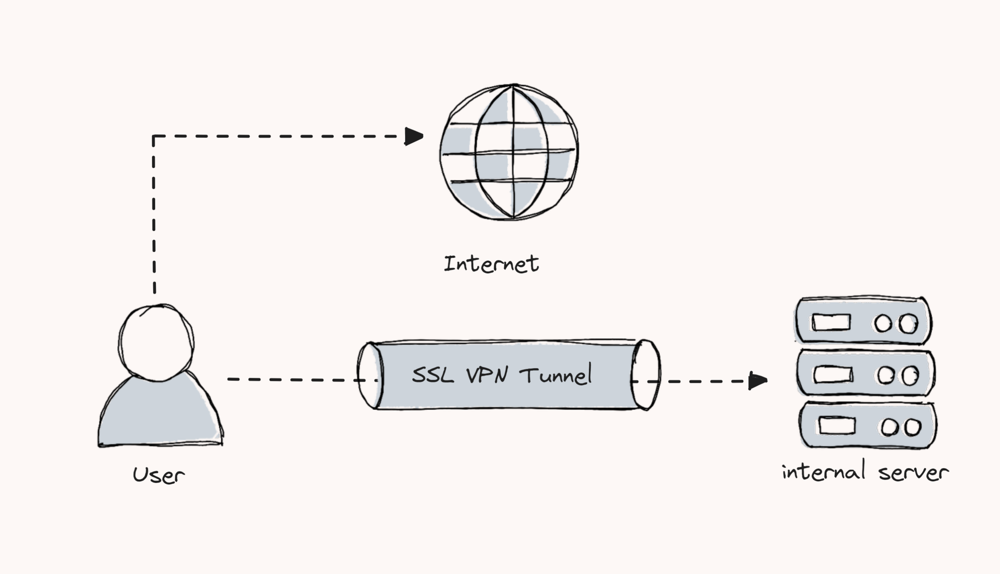

```bash
					  ┌──→ YouTube, Google  → Internet langsung
Computer ──→ Traffic ─┤
                      └──→ AWS Resources   → VPN → AWS Private Network
```

## Configure Split Tunnel VPN
Konfigurasi `Split Tunnel` hanya akan merutekan traffic `VPN`  ke jaringan `AWS` yang telah di konfigurasi.


Jika `VPN Server` sedang berjalan dan kita butuh melakukan konfigurasi pada `VPN Server`, Kita perlu menghentikan server sebelum melakukan perubahan.


Di tab server, klik button stop server untuk menghentikan server. Lalu kita perlu menghapus route yang mengarah ke ip `0.0.0.0/0`, Route ini akan mengizinkan semua traffic untuk masuk ke `VPN Tunnel`, Jadi kita perlu menghapus Route ini.
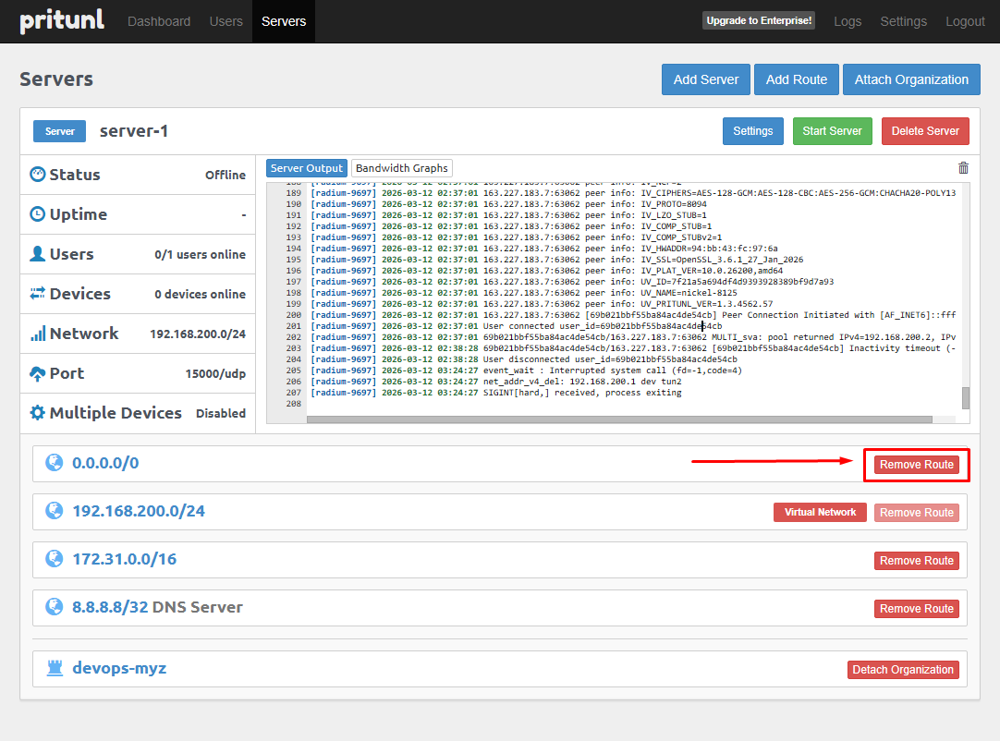

### Validating Pritunl VPN Setup

Untuk testing `Pritunl` Setup, kita perlu test koneksi menggunakan `AWS EC2 Instance` dengan `private subnet`.


Untuk itu, perlu membuat `EC2 Instance` dengan `private subnet` yang telah dikonfigurasi di server `Pritunl`.


Hal yang paling penting agar instances bisa terhubung dengan `Pritunl Server`,  yaitu gunakan `VPC` dan `security group` yang sama dengan `Pritunl Server`.
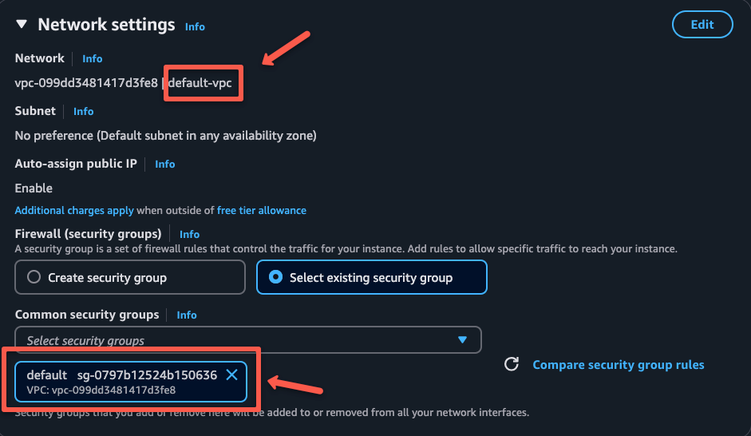


Jika instances sudah ber status running, Copy `private ip` untuk mencoba validasi `VPN Setup`. 
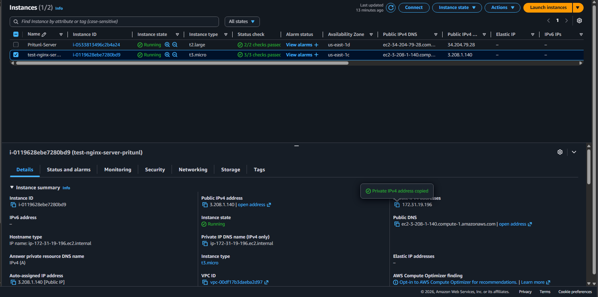

Lalu coba lakukan `SSH` menggunakan `private IP` dari local device.
> Pastikan Pritunl client sedang aktif
```
ssh -i <PATH_TO_KEY_PAIRS> ubuntu@<PRIVATE_IP>
```

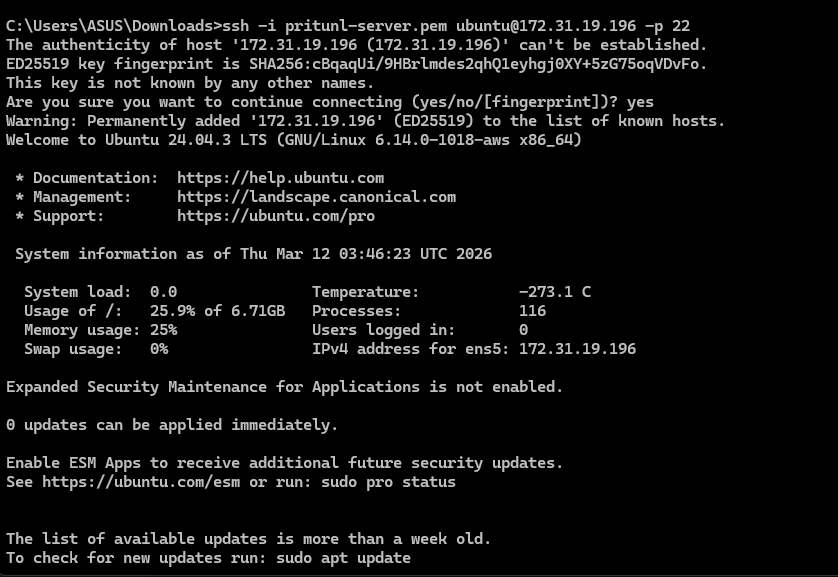

Jika semua konfigurasi sudah benar, kita tidak akan mengalami error ketika melakukan `SSH` menggunakan `private ip` dari local device. Kalau sudah berhasil connect, coba lakukan installasi `nginx web server`, untuk testing `HTTP` Access.
```bash
sudo apt update && sudo apt install nginx -y
```

Untuk melihat apakah `Nginx` berhasil di install dan running, cek menggunakan command berikut
```bash
systemctl status nginx.service
```

Jika status `nginx` running, Buka browser dan masukan private ip. Seharusnya akan menampilkan halaman default nginx.


> Dalam environment nyata, Seluruh jaringan akan bersifat private kecuali yang menjadi host dari server `Pritunl`, Kita bisa menggunakan `VPC Peering` untuk menghubungkan berbagai `VPC` agar dapat berkomunikasi satu sama lain melalui server `VPN`.


Gambar berikut menunjukkan keseluruhan alur kerja dari setup Pritunl kita dan alur traffic-nya.
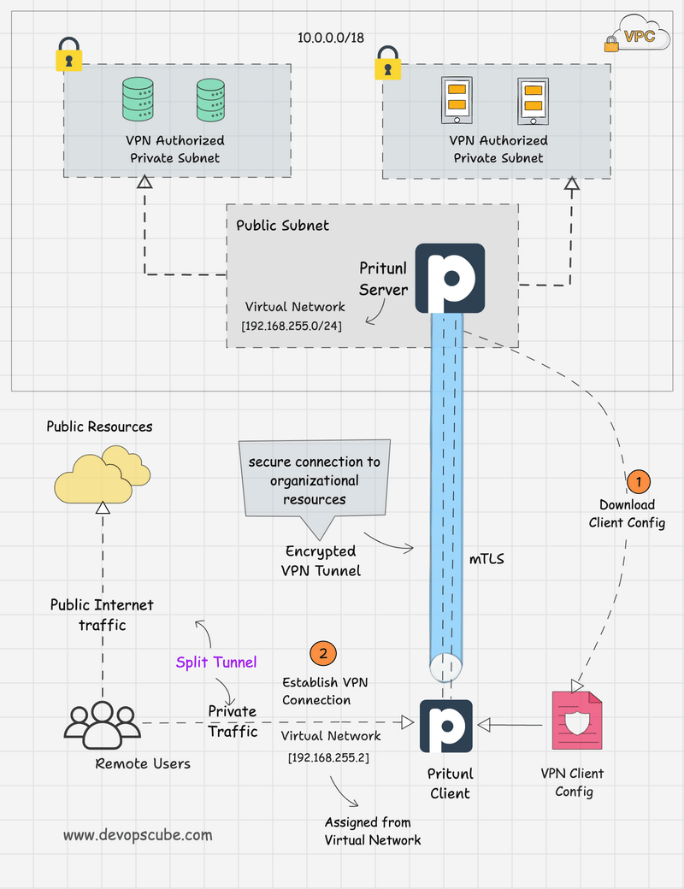